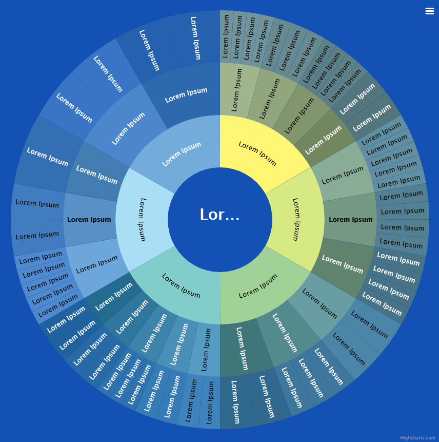
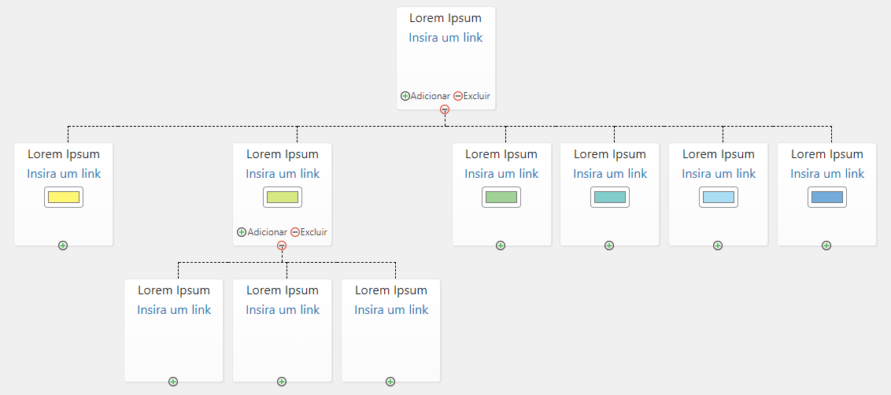

# mandala-editor-plugin

O mandala-editor-plugin é um plugin que implementa uma Mandala, um gráfico Sunburst (explosão solar) que é ideal para exibir dados hierárquicos. Além disso, o plugin inclui um editor customizado que permite editar os dados da Mandala.

## Mandala
A Mandala é implementada utilizando a biblioteca [Highcharts.js](https://www.highcharts.com/) na versão 9.2.2. 

São usados os módulos da Highcharts.js:
- js-original/highcharts.js
- js-original/sunburst.js
- js-original/exporting.js
- js-original/export-data.js
- js-original/accessibility.js

A customização da Mandala é feita no arquivo **js/functions-highcharts.js**. O design da Mandala é personalizado com definição de cores de folhas e redirecionamento para links no último nó de uma folha da Mandala. Além disso, o menu de exportação da Mandala foi traduzido para português.

## Editor
O editor da Mandala é implementado utilizando o plugin [OrgChart](https://www.jqueryscript.net/chart-graph/Create-An-Editable-Organization-Chart-with-jQuery-orgChart-Plugin.html), que utiliza o jQuery fornecido pelo WordPress, atualmente na versão 3.6.4.

A customização foi feita no arquivo **js/jquery-orgchart.js** enquanto a implementação está no **js/functions-editor.js**.

O editor da Mandala inclui uma conexão com a Mandala por meio de um arquivo de texto dados-mandala.txt. O editor permite a criação e exclusão de folhas e nós na Mandala, a edição de nomes, links e cores dos dados da Mandala e a visualização dos dados com botões de mostrar/esconder. 
